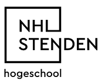

# Programme

## Day 1

*Starting at 08:30*

**Registration (30 min)**

Name, NHL e-mail, phone

**Student introduction (10 min)**

**Course Introduction (30 min)**

**Lab tools setup (30 min)**

1. Chrome

2. Google Drive

3. Live Notebook

4. Github

5. SSH

6. Google Cloud

7. Qwiklab

**Deep Learning Libraries (45 min)**

LAB 1.1: [Applications of Deep Learning with Caffe, Theano and Torch](https://spl-nvlabs.qwiklab.com/focuses/223)

**Coffee break (15 min)**

**Introduction to Image Classification (2h 30 min)**

LAB 1.2: [Image Classification with DIGITS](https://spl-nvlabs.qwiklab.com/focuses/1579)

**Lunch break (45 min)**

**Softmax, One-hot encoding, Cross-Entropy (3 hours)**

[Docker ](https://docs.docker.com/engine/installation/linux/docker-ce/ubuntu/#install-using-the-repository)installation on Google Cloud

LAB 1.3: Assignment - notMNIST

## Day 2

*Starting at 08:30*

**Review Day 1 (30 min)**

**Object Detection (1h 30)**

LAB 2.1: [Object Detection with DIGITS](https://spl-nvlabs.qwiklab.com/focuses/1204)

**Coffee break (15 min)**

**Google cloud upgrade (30 min)**

LAB 2.2: Create GPU instances on Google Cloud

LAB 2.3: Install Keras + Tensorflow on Google Cloud

**Introduction to Keras - Part 1 (2 hours)**

**Lunch break (45 min)**

**Introduction to Keras - Part 2 (2 hours)**

**Optimisation, Stochastic Gradient Descent, Momentum, Learning Rate**

## Day 3

*Starting at 08:30*

**Review Day 1 (30 min)**

**Image Segmentation**** (120 min)**

LAB 3.1: [Medical Image Segmentation Using DIGITS](https://spl-nvlabs.qwiklab.com/focuses/2794?locale=en)

**Coffee break (15 min)**

**Object detection with DIGITS on Google Cloud (3 hours)**

LAB3.2: [Develop a car detector](https://github.com/NVIDIA/DIGITS/tree/master/examples/object-detection)

**Lunch break (45 min)**

**Introduction to Keras - Part 3 (2 hours)**

LAB 3.3: Develop an object recognition system with Keras

## Day 4

*Starting at 08:30*

**Review Day 1 (30 min)**

**Deep & Convolutional Neural Networks (1 hour)**

LAB 4.1: Convolutional Neural Networks (see instructions [below](#heading=h.tka26q11749q))

**Coffee break (15 min)**

**Deep Models for Text and Sequences**

**Lunch break (45 min)**

**Semantic ****Segmentation (120 min)**

LAB 4.2: [Semantic Image Segmentation Using DIGITS](https://github.com/NVIDIA/DIGITS/tree/master/examples/semantic-segmentation)

**Introduction to Generative Adversarial Networks**

LAB 4.3: Generative adversarial networks with Keras

## Day 5: Deep-Learning Hackathon

### Real-time object recognition system

#### Steps:

1. Online research

    1. What are the methods?

    2. Which method is the most suitable?

2. Planning / Design

3. Implementation

    3. Camera capture

        1. How do you capture an image from your laptop webcam using python?

    4. Deep-learning classifier

        2. Which machine is better to use? Your own or Google cloud?

        3. Which classification method is best?

    5. Real-time constraints

        4. How can you obtain results in real-time?

